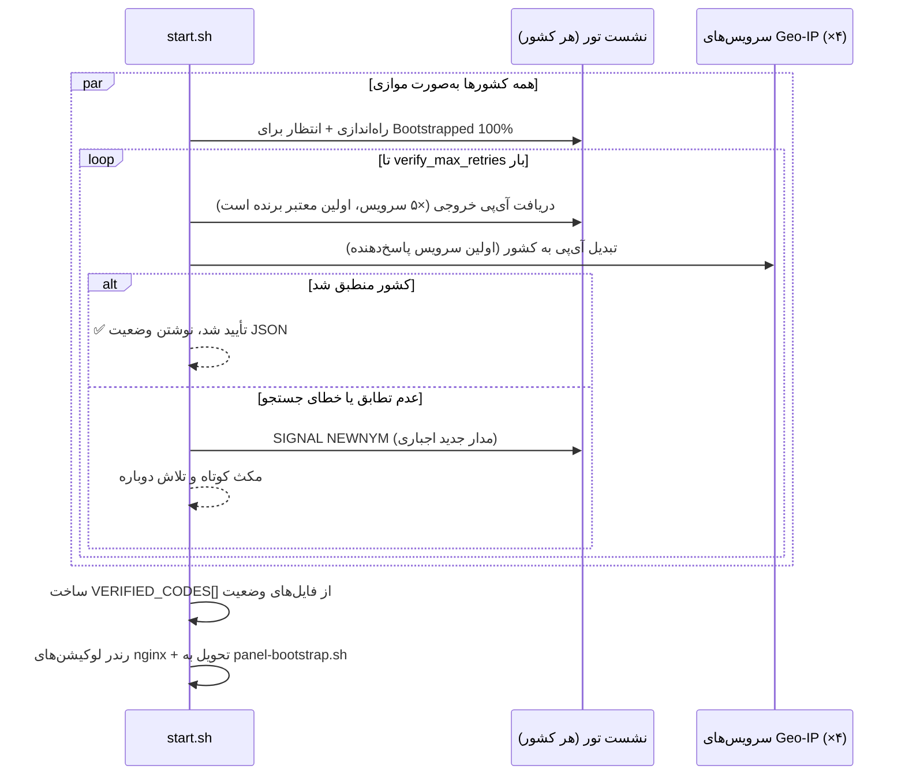

<p align="center" dir="ltr">
  <a href="README.md"><b>English</b></a> &nbsp;|&nbsp; <a href="README.fa.md">فارسی</a>
</p>

<div align="center" dir="rtl">


<!-- ================= لوگوی انیمیشنی CR ================= -->
<svg xmlns="http://www.w3.org/2000/svg" viewBox="0 0 140 140" width="140" height="140">
  <defs>
    <linearGradient id="crg" x1="0" y1="0" x2="1" y2="1">
      <stop offset="0%" stop-color="#8b5cf6"/>
      <stop offset="50%" stop-color="#a855f7"/>
      <stop offset="100%" stop-color="#22d3ee"/>
    </linearGradient>
  </defs>
  <g>
    <animateTransform attributeName="transform" type="rotate" from="0 70 70" to="360 70 70" dur="24s" repeatCount="indefinite"/>
    <polygon points="70,10 123,40 123,100 70,130 17,100 17,40" fill="rgba(139,92,246,0.06)" stroke="url(#crg)" stroke-width="3"/>
  </g>
  <circle cx="70" cy="70" r="30" fill="url(#crg)">
    <animate attributeName="r" values="26;34;26" dur="2.2s" repeatCount="indefinite"/>
    <animate attributeName="opacity" values="0.75;1;0.75" dur="2.2s" repeatCount="indefinite"/>
  </circle>
  <text x="70" y="79" font-family="Vazirmatn, Tahoma, sans-serif" font-size="26" font-weight="bold" fill="#ffffff" text-anchor="middle">CR</text>
  <circle r="6" fill="#22d3ee">
    <animateMotion dur="6s" repeatCount="indefinite" path="M70,22 a48,48 0 1,1 -0.01,0"/>
  </circle>
  <circle r="4" fill="#f59e0b">
    <animateMotion dur="9s" repeatCount="indefinite" path="M70,22 a48,48 0 1,0 -0.01,0"/>
  </circle>
</svg>

# ⚡ سایبر ریج مالتـی پنـل (Cyber-Rage Multi Panel)

### 🌍 دروازه‌ی چندکشوری VLESS — یک پورت عمومی، ده کشور


<br/>

<!-- ================= نشان‌های انیمیشنی ================= -->
<table align="center" dir="ltr">
<tr>

<td align="center">
<svg xmlns="http://www.w3.org/2000/svg" width="128" height="30" viewBox="0 0 128 30">
  <defs><linearGradient id="bg1" x1="0" y1="0" x2="1" y2="0"><stop offset="0%" stop-color="#8b5cf6"/><stop offset="100%" stop-color="#22d3ee"/></linearGradient></defs>
  <rect width="128" height="30" rx="15" fill="#111827"/>
  <rect width="128" height="30" rx="15" fill="url(#bg1)" opacity="0.16">
    <animate attributeName="opacity" values="0.16;0.32;0.16" dur="2.4s" repeatCount="indefinite"/>
  </rect>
  <circle cx="18" cy="15" r="7" fill="#22c55e">
    <animate attributeName="r" values="4;7;4" dur="1.4s" repeatCount="indefinite"/>
    <animate attributeName="opacity" values="1;0.35;1" dur="1.4s" repeatCount="indefinite"/>
  </circle>
  <text x="33" y="19" font-family="Verdana, sans-serif" font-size="10.5" font-weight="bold" fill="#e5e7eb">STATUS</text>
  <text x="78" y="19" font-family="Verdana, sans-serif" font-size="10.5" font-weight="bold" fill="#22c55e">ONLINE</text>
</svg>
</td>

<td align="center">
<svg xmlns="http://www.w3.org/2000/svg" width="128" height="30" viewBox="0 0 128 30">
  <defs><linearGradient id="bg2" x1="0" y1="0" x2="1" y2="0"><stop offset="0%" stop-color="#3b82f6"/><stop offset="100%" stop-color="#22d3ee"/></linearGradient></defs>
  <rect width="128" height="30" rx="15" fill="#111827"/>
  <rect width="128" height="30" rx="15" fill="url(#bg2)" opacity="0.16">
    <animate attributeName="opacity" values="0.16;0.32;0.16" dur="2.8s" repeatCount="indefinite"/>
  </rect>
  <circle cx="18" cy="15" r="7" fill="#3b82f6">
    <animate attributeName="r" values="4;7;4" dur="1.8s" repeatCount="indefinite"/>
    <animate attributeName="opacity" values="1;0.35;1" dur="1.8s" repeatCount="indefinite"/>
  </circle>
  <text x="33" y="19" font-family="Verdana, sans-serif" font-size="10.5" font-weight="bold" fill="#e5e7eb">PORT</text>
  <text x="66" y="19" font-family="Verdana, sans-serif" font-size="10.5" font-weight="bold" fill="#60a5fa">3000</text>
</svg>
</td>

<td align="center">
<svg xmlns="http://www.w3.org/2000/svg" width="140" height="30" viewBox="0 0 140 30">
  <defs><linearGradient id="bg3" x1="0" y1="0" x2="1" y2="0"><stop offset="0%" stop-color="#f59e0b"/><stop offset="100%" stop-color="#ef4444"/></linearGradient></defs>
  <rect width="140" height="30" rx="15" fill="#111827"/>
  <rect width="140" height="30" rx="15" fill="url(#bg3)" opacity="0.16">
    <animate attributeName="opacity" values="0.16;0.32;0.16" dur="3.2s" repeatCount="indefinite"/>
  </rect>
  <circle cx="18" cy="15" r="7" fill="#f59e0b">
    <animate attributeName="r" values="4;7;4" dur="2.2s" repeatCount="indefinite"/>
    <animate attributeName="opacity" values="1;0.35;1" dur="2.2s" repeatCount="indefinite"/>
  </circle>
  <text x="33" y="19" font-family="Verdana, sans-serif" font-size="10.5" font-weight="bold" fill="#e5e7eb">COUNTRIES</text>
  <text x="95" y="19" font-family="Verdana, sans-serif" font-size="10.5" font-weight="bold" fill="#fbbf24">10</text>
</svg>
</td>

<td align="center">
<svg xmlns="http://www.w3.org/2000/svg" width="150" height="30" viewBox="0 0 150 30">
  <defs><linearGradient id="bg4" x1="0" y1="0" x2="1" y2="0"><stop offset="0%" stop-color="#a855f7"/><stop offset="100%" stop-color="#8b5cf6"/></linearGradient></defs>
  <rect width="150" height="30" rx="15" fill="#111827"/>
  <rect width="150" height="30" rx="15" fill="url(#bg4)" opacity="0.16">
    <animate attributeName="opacity" values="0.16;0.32;0.16" dur="2.6s" repeatCount="indefinite"/>
  </rect>
  <circle cx="18" cy="15" r="7" fill="#a855f7">
    <animate attributeName="r" values="4;7;4" dur="1.6s" repeatCount="indefinite"/>
    <animate attributeName="opacity" values="1;0.35;1" dur="1.6s" repeatCount="indefinite"/>
  </circle>
  <text x="33" y="19" font-family="Verdana, sans-serif" font-size="10.5" font-weight="bold" fill="#e5e7eb">PANEL</text>
  <text x="74" y="19" font-family="Verdana, sans-serif" font-size="10.5" font-weight="bold" fill="#c4b5fd">3x-ui</text>
</svg>
</td>

</tr>
</table>

<!-- ================= نوار متریک‌های انیمیشنی ================= -->
<br/>
<table align="center" dir="ltr">
<tr>
<td align="center">
<b>🚀 افزایش سرعت</b><br/>
<svg xmlns="http://www.w3.org/2000/svg" viewBox="0 0 200 22" width="200" height="22">
  <defs><linearGradient id="m1" x1="0" y1="0" x2="1" y2="0"><stop offset="0%" stop-color="#8b5cf6"/><stop offset="100%" stop-color="#22d3ee"/></linearGradient></defs>
  <rect width="200" height="22" rx="11" fill="#111827"/>
  <rect y="3" height="16" rx="8" fill="url(#m1)">
    <animate attributeName="width" values="0;180" dur="2.4s" repeatCount="indefinite"/>
  </rect>
  <text x="100" y="15" font-family="Verdana, sans-serif" font-size="11" font-weight="bold" fill="#ffffff" text-anchor="middle">+40%</text>
</svg>
</td>
<td align="center">
<b>🌍 کشورهای آنلاین</b><br/>
<svg xmlns="http://www.w3.org/2000/svg" viewBox="0 0 200 22" width="200" height="22">
  <defs><linearGradient id="m2" x1="0" y1="0" x2="1" y2="0"><stop offset="0%" stop-color="#22c55e"/><stop offset="100%" stop-color="#22d3ee"/></linearGradient></defs>
  <rect width="200" height="22" rx="11" fill="#111827"/>
  <rect y="3" height="16" rx="8" fill="url(#m2)">
    <animate attributeName="width" values="0;200" dur="3s" repeatCount="indefinite"/>
  </rect>
  <text x="100" y="15" font-family="Verdana, sans-serif" font-size="11" font-weight="bold" fill="#ffffff" text-anchor="middle">10 / 10</text>
</svg>
</td>
<td align="center">
<b>⏱️ تعویض آی‌پی</b><br/>
<svg xmlns="http://www.w3.org/2000/svg" viewBox="0 0 200 22" width="200" height="22">
  <defs><linearGradient id="m3" x1="0" y1="0" x2="1" y2="0"><stop offset="0%" stop-color="#f59e0b"/><stop offset="100%" stop-color="#ef4444"/></linearGradient></defs>
  <rect width="200" height="22" rx="11" fill="#111827"/>
  <rect y="3" height="16" rx="8" fill="url(#m3)">
    <animate attributeName="width" values="0;40" dur="1.4s" repeatCount="indefinite"/>
  </rect>
  <text x="100" y="15" font-family="Verdana, sans-serif" font-size="11" font-weight="bold" fill="#ffffff" text-anchor="middle">5 min</text>
</svg>
</td>
<td align="center">
<b>🛡️ آپ‌تایم</b><br/>
<svg xmlns="http://www.w3.org/2000/svg" viewBox="0 0 200 22" width="200" height="22">
  <defs><linearGradient id="m4" x1="0" y1="0" x2="1" y2="0"><stop offset="0%" stop-color="#22d3ee"/><stop offset="100%" stop-color="#8b5cf6"/></linearGradient></defs>
  <rect width="200" height="22" rx="11" fill="#111827"/>
  <rect y="3" height="16" rx="8" fill="url(#m4)">
    <animate attributeName="width" values="0;199" dur="2.2s" repeatCount="indefinite"/>
  </rect>
  <text x="100" y="15" font-family="Verdana, sans-serif" font-size="11" font-weight="bold" fill="#ffffff" text-anchor="middle">99.9%</text>
</svg>
</td>
</tr>
</table>

</div>

<br/>

> ### 🚀 **این نسخه ریشه‌ی مشکل crash-loop «address already in use» را حل می‌کند**
> اینباند «مستقیم» (غیر تور) و nginx هر دو سعی می‌کردند پورت **8080** را بگیرند در حالی که nginx روی 3000 هم گوش می‌داد — روی پلتفرم‌های تک‌پورتی این همیشه باعث crash-loop می‌شد. حالا **فقط nginx به `0.0.0.0` متصل است** و بقیه روی `127.0.0.1` بایند شده و از پشت nginx پراکسی می‌شوند.

---
## ✨ چرا سایبر ریج مالتـی پنـل؟

<table align="center" dir="rtl">
<tr>
<td width="50%" align="center">

<!-- برق انیمیشنی -->
<svg xmlns="http://www.w3.org/2000/svg" width="54" height="54" viewBox="0 0 54 54">
  <path d="M30 4 L12 30 H24 L20 50 L42 22 H28 Z" fill="#f59e0b">
    <animate attributeName="opacity" values="1;0.4;1" dur="1.2s" repeatCount="indefinite"/>
  </path>
</svg>

### 🚀 **بهینه‌شده برای سرعت**
- `OptimisticData` + زمان ساخت مدار کمتر برای تونل روان‌تر
- `tcpFastOpen` + `tcpKeepAlive` روی همه اینباندها
- پراکسی استریمینگ nginx — **بدون بافرینگ**
- تعویض آی‌پی هر **۵ دقیقه** برای هر کشور

</td>
<td width="50%" align="center">

<!-- سپر انیمیشنی -->
<svg xmlns="http://www.w3.org/2000/svg" width="54" height="54" viewBox="0 0 54 54">
  <path d="M27 4 L46 12 V26 C46 38 38 46 27 50 C16 46 8 38 8 26 V12 Z" fill="rgba(34,197,94,0.12)" stroke="#22c55e" stroke-width="3">
    <animate attributeName="opacity" values="0.6;1;0.6" dur="2s" repeatCount="indefinite"/>
  </path>
  <path d="M18 26 L25 33 L38 19" fill="none" stroke="#22c55e" stroke-width="4" stroke-linecap="round" stroke-linejoin="round"/>
</svg>

### 🛡️ **حریم خصوصی در اولویت**
- هر کشور **نشست تور ایزوله‌ی خودش** را دارد
- خروجی با `ExitNodes {cc}` + `StrictNodes 1` قفل شده
- کشورهای پرخطر به‌صورت پیش‌فرض حذف شده‌اند
- **هیچ‌جای پنل کلمه‌ی «تور» دیده نمی‌شود**

</td>
</tr>
<tr>
<td width="50%" align="center">

<!-- چرخ‌دنده انیمیشنی -->
<svg xmlns="http://www.w3.org/2000/svg" width="54" height="54" viewBox="0 0 54 54">
  <g>
    <animateTransform attributeName="transform" type="rotate" from="0 27 27" to="360 27 27" dur="8s" repeatCount="indefinite"/>
    <circle cx="27" cy="27" r="9" fill="#8b5cf6"/>
    <g stroke="#8b5cf6" stroke-width="6" stroke-linecap="round">
      <line x1="27" y1="6" x2="27" y2="14"/><line x1="27" y1="40" x2="27" y2="48"/>
      <line x1="6" y1="27" x2="14" y2="27"/><line x1="40" y1="27" x2="48" y2="27"/>
      <line x1="12" y1="12" x2="18" y2="18"/><line x1="36" y1="36" x2="42" y2="42"/>
      <line x1="12" y1="42" x2="18" y2="36"/><line x1="36" y1="18" x2="42" y2="12"/>
    </g>
  </g>
</svg>

### ⚙️ **اتوماسیون کامل**
- کشف و تأیید خودکار کشور (موازی، چندمنبعی)
- ساخت خودکار اینباند/کلاینت/مسیریابی با API پنل 3x-ui
- کشورهای ناموفق **هیچ** اینباند/کلاینتی نمی‌گیرند
- لینک‌ها، پنل و فایل‌های وضعیت خودکار ساخته می‌شوند

</td>
<td width="50%" align="center">

<!-- کره انیمیشنی -->
<svg xmlns="http://www.w3.org/2000/svg" width="54" height="54" viewBox="0 0 54 54">
  <circle cx="27" cy="27" r="20" fill="rgba(34,211,238,0.12)" stroke="#22d3ee" stroke-width="2.5"/>
  <ellipse cx="27" cy="27" rx="20" ry="8" fill="none" stroke="#22d3ee" stroke-width="1.5">
    <animateTransform attributeName="transform" type="rotate" from="0 27 27" to="360 27 27" dur="10s" repeatCount="indefinite"/>
  </ellipse>
  <line x1="27" y1="7" x2="27" y2="47" stroke="#22d3ee" stroke-width="1.5"/>
  <circle r="4" fill="#f59e0b">
    <animateMotion dur="6s" repeatCount="indefinite" path="M27,7 a20,8 0 1,1 -0.01,0"/>
  </circle>
</svg>

### 🔀 **مسیریابی چندکشوری**
- `/` → مستقیم (آی‌پی خود سرور، **بدون تور**)
- `/in1`…`/in10` → ۱۰ خروجی از کشورهای مختلف
- فقط یک پورت عمومی **3000** — همه‌چیز پشت nginx
- چرخش خودکار با **خوداصلاحی کشوری**

</td>
</tr>
</table>

---

## 📐 معماری

```mermaid
flowchart LR
    subgraph Public["🌍 اینترنت عمومی"]
        C[کلاینت]
    end

    subgraph Container["کانتینر — فقط پورت 3000 باز است"]
        N["nginx :3000 (تنها اتصال عمومی)"]
        D["xray اینباند مستقیم 127.0.0.1:8080"]
        P["پنل 3x-ui 127.0.0.1:2053"]

        subgraph Countries["نشست‌های ایزوله هر کشور (فقط تأییدشده‌ها)"]
            direction TB
            I1["xray اینباند /in1 127.0.0.1:8081"] --> T1["نشست تور: de SOCKS 127.0.0.1:9052"]
            I2["xray اینباند /in2 127.0.0.1:8082"] --> T2["نشست تور: fr SOCKS 127.0.0.1:9053"]
        end

        N -->|"/"  "/direct"| D
        N -->|"/managepanel/"| P
        N -->|"/in1"| I1
        N -->|"/in2"| I2
    end

    C --> N
```

<details>
<summary><b>چرا این مشکل «کانفیگ مستقیم کار نمی‌کند» را حل می‌کند؟</b> (برای باز کردن کلیک کنید)</summary>
<br/>

قبلش: `nginx` روی `3000` گوش می‌داد **و** اینباند مستقیم xray هم سعی می‌کرد روی `0.0.0.0:8080` بایند شود. روی پلتفرمی که فقط **یک** پورت خارجی به کانتینر شما می‌دهد، این بایند دوم یا خطا می‌داد یا با nginx تداخل می‌کرد — کانتینر کرش می‌کرد.

```
ERROR - XRAY: Failed to start: ... failed to listen on address: 0.0.0.0:8080
         ... bind: address already in use
```

حالا: `nginx` **تنها** پروسه‌ای است که روی `0.0.0.0` (پورت `3000`) بایند شده. اینباند مستقیم روی `127.0.0.1:8080` (فقط لوپ‌بک) بایند می‌شود و لوکیشن‌های `/` و `/direct` در nginx به آن پراکسی می‌دهند. بقیه پروسه‌ها — پنل، نشست‌های تور و اینباندهای کشوری — همگی فقط لوپ‌بک هستند.

</details>

---

## 🚀 نصب و راه‌اندازی

### 1️⃣ کلون و دیپلوی

```bash
# روی هر هاست تک‌پورتی: Railway، Koyeb، Render، Fly.io و...
git clone https://github.com/x4gKing/3x-ui-multi.git
cd 3x-ui-multi
# کافیه این ریپو رو به پلتفرم بدید — Dockerfile داخلش هست!
```

### 2️⃣ متغیرهای محیطی اختیاری

| متغیر | کاربرد | پیش‌فرض |
|---|---|---|
| `XUI_USERNAME` | نام کاربری پنل | `admin` |
| `XUI_PASSWORD` | رمز پنل | `admin` |
| `XUI_API_TOKEN` | توکن Bearer، ورود با فرم را دور می‌زند | *(تنظیم‌نشده)* |
| `PUBLIC_DOMAIN` | جایگزینی دامنه‌ی خودکار شناسایی‌شده | شناسایی خودکار |

> بقیه تنظیمات — پورت عمومی، فاصله‌ی چرخش، تایم‌اوت‌ها و لیست کشورها — همه در **`config.json`** است.

---

## 📡 اندپوینت‌ها

همه اندپوینت‌ها روی **یک پورت عمومی (`3000`)** از طریق nginx سرو می‌شوند.

| مسیر | نوع | توضیحات |
|---|---|---|
| `/` | 🌐 مستقیم | پیش‌فرض — آی‌پی خود سرور، بدون تور |
| `/direct` | 🌐 مستقیم | همان `/` با مسیر صریح |
| `/in1` … `/in10` | 🔒 خروجی کشوری | فقط اگر آن کشور در کشف تأیید شده باشد — نگاشت مسیر به کشور در `config.json` |
| `/managepanel/` | — | پنل مدیریت 3x-ui |
| `/tor-status/all.json` | — | وضعیت زنده همه کشورها |
| `/tor-status/<code>.json` | — | وضعیت زنده یک کشور (`exit_ip`، `verified`، `checked_at` و…) |
| `/health`, `/ping` | — | بررسی سلامت |

<details>
<summary>لیست پیش‌فرض کشورها (۱۰ کشور در <code>config.json</code>)</summary>
<br/>

| مسیر | کشور |
|---|---|
| `/in1` | 🇨🇦 کانادا |
| `/in2` | 🇹🇷 ترکیه |
| `/in3` | 🇩🇪 آلمان |
| `/in4` | 🇫🇷 فرانسه |
| `/in5` | 🇸🇪 سوئد |
| `/in6` | 🇨🇭 سوئیس |
| `/in7` | 🇫🇮 فنلاند |
| `/in8` | 🇬🇧 بریتانیا |
| `/in9` | 🇪🇸 اسپانیا |
| `/in10` | 🇷🇴 رومانی |

هر کدام را می‌توانید با ویرایش آرایه‌ی `tor.countries` در `config.json` اضافه/حذف/جابجا کنید — هیچ‌کدام از اسکریپت‌ها به طول یا مسیر خاصی وابسته نیستند.

</details>

---

## 🔎 فرایند کشف کشورها

<table align="center" dir="rtl">
<tr>
<td align="center" width="30%">

<!-- رادار انیمیشنی -->
<svg xmlns="http://www.w3.org/2000/svg" width="120" height="120" viewBox="0 0 110 110">
  <circle cx="55" cy="55" r="50" fill="none" stroke="#312e81" stroke-width="2"/>
  <circle cx="55" cy="55" r="33" fill="none" stroke="#312e81" stroke-width="1.5"/>
  <circle cx="55" cy="55" r="16" fill="none" stroke="#312e81" stroke-width="1.5"/>
  <path d="M55,55 L105,55 A50,50 0 0 1 90,90 Z" fill="rgba(139,92,246,0.35)">
    <animateTransform attributeName="transform" type="rotate" from="0 55 55" to="360 55 55" dur="3s" repeatCount="indefinite"/>
  </path>
  <circle cx="55" cy="55" r="3.5" fill="#22d3ee"/>
  <circle cx="74" cy="33" r="4" fill="#22c55e"><animate attributeName="opacity" values="1;0.25;1" dur="1.8s" repeatCount="indefinite"/></circle>
  <circle cx="38" cy="70" r="4" fill="#f59e0b"><animate attributeName="opacity" values="1;0.25;1" dur="2.4s" repeatCount="indefinite"/></circle>
  <circle cx="78" cy="66" r="3.5" fill="#e879f9"><animate attributeName="opacity" values="1;0.25;1" dur="2.1s" repeatCount="indefinite"/></circle>
</svg>

<br/>
<b>رادار زنده‌ی کشف</b>

</td>
<td width="70%">



</td>
</tr>
</table>

همه‌چیز زیر کلید `tor.*` در `config.json` بدون دست زدن به اسکریپت قابل تنظیم است:

```jsonc
"tor": {
    "bootstrap_timeout": 240,     // حداکثر انتظار برای رسیدن تور به 100%
    "verify_max_retries": 15,     // تلاش برای پیدا کردن خروجی با کشور درست
    "verify_retry_sleep": 4,      // ثانیه بین تلاش‌ها
    "circuit_settle_sleep": 6,    // زمان نشستن بعد از مدار تازه
    "parallel_bootstrap": true,   // راه‌اندازی و تأیید همه کشورها همزمان
    "parallel_verify": true
}
```

---

## 🔁 تعویض خودکار آی‌پی

هر کشور **تأییدشده** چرخه‌ی چرخش پس‌زمینه‌ی خودش را دارد (`tor.rotate_seconds`، پیش‌فرض `300` ثانیه):

1. `SIGNAL NEWNYM` به `ControlPort` همان کشور فرستاده می‌شود — مدار تور تازه، یعنی آی‌پی خروجی تازه.
2. آی‌پی خروجی جدید با همان جستجوی چندمنبعی Geo-IP دوباره بررسی می‌شود.
3. اگر آی‌پی جدید هنوز در کشور درست باشد، فایل وضعیت به‌روز می‌شود و کلاینت **بدون قطعی** کار می‌کند.
4. اگر چرخش اول به کشور اشتباه برود، یک بار دیگر بلافاصله تلاش می‌شود؛ اگر باز هم نشد، کشور تا چرخش بعدی «غیرقابل دسترس» علامت می‌خورد (حذف **نمی‌شود**).

این کار کاملاً داخل `start.sh` انجام می‌شود (`rotate_and_verify()`) — بدون cron خارجی، بدون پروسه‌ی اضافه.

---

## 🔒 امنیت و نام‌گذاری

- **اتصال مستقیم** پیش‌فرض روی `/` و `/direct` است — بدون تور.
- **اتصالات کشوری** روی مسیرهای `/inN` در دسترس‌اند، اما **فقط برای کشورهایی که کشف را رد کرده‌اند**.
- **اجرای سخت‌گیرانه‌ی خروجی** — هر نشست تور با `ExitNodes {cc}` + `StrictNodes 1` قفل شده؛ از نظر معماری نمی‌تواند از جای دیگری خارج شود.
- **مناطق حذف‌شده** — `tor.exclude_countries` در `config.json` (کشورهای دارای محدودیت و پرخطر) از خروجی همه نشست‌ها حذف شده‌اند.
- **بدون «تور» در پنل** — تگ‌ها، رمارک‌ها، اوت‌باندها و قوانین مسیریابی فقط کد/نام کشور را دارند. اسکرین‌شات‌ها، لینک‌های کلاینت و کانفیگ JSON xray هرگز شامل این کلمه نیستند.
- **فقط nginx عمومی است** — پنل، اینباند مستقیم، همه اینباندهای کشوری و همه پورت‌های SOCKS/Control تور فقط روی `127.0.0.1` بایند شده‌اند.

---

## 🚀 بهینه‌سازی‌های سرعت

این نسخه شامل تنظیمات هدفمند تأخیر و پهنای باند است:

| لایه | بهینه‌سازی |
|---|---|
| **تور** | `OptimisticData 1`، `CircuitBuildTimeout 90`، `ConnectionPadding 0` (سربار کمتر)، `EnforceDistinctSubnets 1` |
| **اینباندهای Xray** | `tcpFastOpen: true`، `tcpKeepAlive: true` روی استریم همه اینباندها |
| **اوت‌باندهای Xray** | اوت‌باندهای SOCKS با `tcpFastOpen` + `tcpKeepAlive` به سمت تور |
| **nginx** | `proxy_buffering off`، `proxy_request_buffering off`، `tcp_nodelay`، `sendfile` |

<!-- اکولایزر انیمیشنی -->
<div align="center">
<svg xmlns="http://www.w3.org/2000/svg" width="60" height="28" viewBox="0 0 40 28">
  <rect x="3" y="18" width="5" height="8" rx="2" fill="#22d3ee"><animate attributeName="y" values="18;8;18" dur="0.8s" repeatCount="indefinite"/><animate attributeName="height" values="8;18;8" dur="0.8s" repeatCount="indefinite"/></rect>
  <rect x="12" y="14" width="5" height="12" rx="2" fill="#8b5cf6"><animate attributeName="y" values="14;22;14" dur="0.6s" repeatCount="indefinite"/><animate attributeName="height" values="12;4;12" dur="0.6s" repeatCount="indefinite"/></rect>
  <rect x="21" y="8" width="5" height="18" rx="2" fill="#22c55e"><animate attributeName="y" values="8;18;8" dur="0.9s" repeatCount="indefinite"/><animate attributeName="height" values="18;8;18" dur="0.9s" repeatCount="indefinite"/></rect>
  <rect x="30" y="12" width="5" height="14" rx="2" fill="#f59e0b"><animate attributeName="y" values="12;4;12" dur="0.7s" repeatCount="indefinite"/><animate attributeName="height" values="14;22;14" dur="0.7s" repeatCount="indefinite"/></rect>
</svg>
<br/>
<b>تونلینگ با سرعت کامل</b>
</div>

---

## 📋 لاگ‌ها

| فایل | محتوا |
|---|---|
| `/var/log/panel-bootstrap.log` | راه‌اندازی پنل: ساخت/حذف اینباند، کلاینت و مسیریابی |
| `/var/log/tor/rotate.log` | چرخه‌های تعویض خودکار آی‌پی |
| `/var/log/tor/<code>-stdout.log` | خروجی خام آن کشور از فرایند تور |
| `/var/log/tor/<code>/notices.log` | لاگ اطلاع‌رسانی تور (پیشرفت بوت‌استرپ، رویدادهای مدار) |
| `/var/log/tor/<code>/warnings.log` | لاگ هشدارهای تور |
| `/var/www/tor-status/<code>.json` | وضعیت زنده و قابل‌خواندن ماشینی آن کشور |
| `/var/www/tor-status/all.json` | همه کشورها با هم |
| `/var/www/tor-status/setup-progress.json` | پیشرفت کلی `{total, verified, complete}` |

---

## 🗂️ ساختار فایل‌ها

```
.
├── Dockerfile               # ساخت ایمج؛ فقط پورت 3000 را EXPOSE می‌کند + healthcheck
├── config.json              # منبع واحد حقیقت برای پورت‌ها، کشورها و تنظیمات
├── nginx.conf.template      # در شروع کانتینر رندر می‌شود (envsubst + لوکیشن‌های داینامیک)
├── start.sh                 # نقطه ورود: اجرای تور، کشف، چرخش، رندر nginx و اجرای nginx
├── panel-bootstrap.sh       # ارتباط با API پنل 3x-ui: اینباند/کلاینت/مسیریابی کشورهای تأییدشده
└── api-deploy-it-on-cloudflare.js  # Worker اختیاری Cloudflare: بررسی تور/آی‌پی خروجی + API جستجو
```

---

## 📜 لایسنس و قدردانی
- **شبکه خروجی:** [پروژه تور](https://www.torproject.org/)
- **برند و نگهداری:** [Cyber-Rage](https://github.com/cyberrage-ananymus) ⚡

<div align="center">
<br/>


<svg xmlns="http://www.w3.org/2000/svg" width="18" height="18" viewBox="0 0 20 20">
  <path d="M10 18 C 4 12, 2 8, 2 5 C 2 2, 5 1, 7 3 C 8 4, 9 5, 10 6 C 11 5, 12 4, 13 3 C 15 1, 18 2, 18 5 C 18 8, 16 12, 10 18 Z" fill="#f43f5e">
    <animate attributeName="opacity" values="1;0.35;1" dur="1.4s" repeatCount="indefinite"/>
  </path>
</svg>

**⚡ سایبر ریج مالتـی پنـل — یک پورت. ده کشور. بدون محدودیت.**

<svg xmlns="http://www.w3.org/2000/svg" width="18" height="18" viewBox="0 0 20 20">
  <path d="M10 18 C 4 12, 2 8, 2 5 C 2 2, 5 1, 7 3 C 8 4, 9 5, 10 6 C 11 5, 12 4, 13 3 C 15 1, 18 2, 18 5 C 18 8, 16 12, 10 18 Z" fill="#f43f5e">
    <animate attributeName="opacity" values="1;0.35;1" dur="1.8s" repeatCount="indefinite"/>
  </path>
</svg>

</div>
