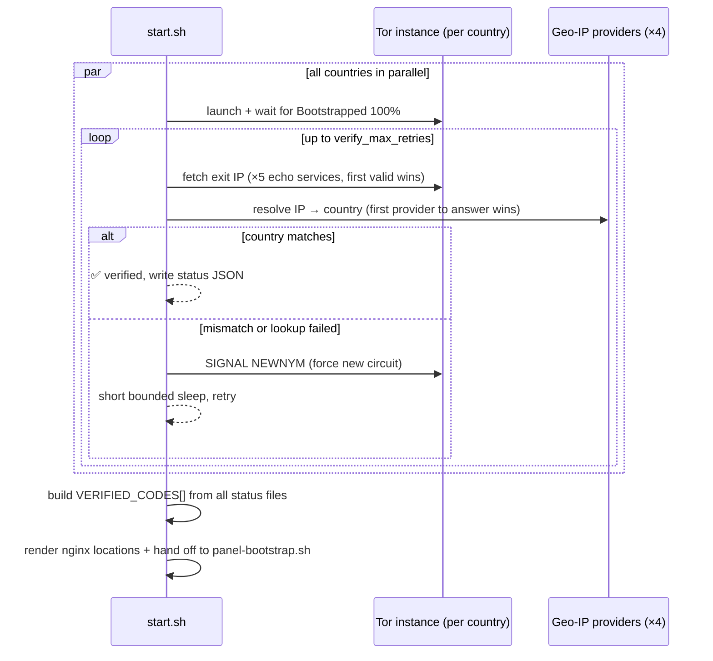

<p align="center" dir="ltr">
  <a href="README.md"><b>English</b></a> &nbsp;|&nbsp; <a href="README.fa.md">فارسی</a>
</p>

<div align="center">


<!-- ================= ANIMATED CR LOGO ================= -->
<svg xmlns="http://www.w3.org/2000/svg" viewBox="0 0 140 140" width="140" height="140">
  <defs>
    <linearGradient id="crg" x1="0" y1="0" x2="1" y2="1">
      <stop offset="0%" stop-color="#8b5cf6"/>
      <stop offset="50%" stop-color="#a855f7"/>
      <stop offset="100%" stop-color="#22d3ee"/>
    </linearGradient>
  </defs>
  <g>
    <animateTransform attributeName="transform" type="rotate" from="0 70 70" to="360 70 70" dur="24s" repeatCount="indefinite"/>
    <polygon points="70,10 123,40 123,100 70,130 17,100 17,40" fill="rgba(139,92,246,0.06)" stroke="url(#crg)" stroke-width="3"/>
  </g>
  <circle cx="70" cy="70" r="30" fill="url(#crg)">
    <animate attributeName="r" values="26;34;26" dur="2.2s" repeatCount="indefinite"/>
    <animate attributeName="opacity" values="0.75;1;0.75" dur="2.2s" repeatCount="indefinite"/>
  </circle>
  <text x="70" y="79" font-family="Verdana, sans-serif" font-size="28" font-weight="bold" fill="#ffffff" text-anchor="middle">CR</text>
  <circle r="6" fill="#22d3ee">
    <animateMotion dur="6s" repeatCount="indefinite" path="M70,22 a48,48 0 1,1 -0.01,0"/>
  </circle>
  <circle r="4" fill="#f59e0b">
    <animateMotion dur="9s" repeatCount="indefinite" path="M70,22 a48,48 0 1,0 -0.01,0"/>
  </circle>
</svg>

# ⚡ Cyber-Rage Multi Panel

### 🌍 Multi-Country VLESS Gateway — One Public Port, Ten Countries


<br/>

<!-- ================= ANIMATED BADGES ================= -->
<table align="center" dir="ltr">
<tr>

<td align="center">
<svg xmlns="http://www.w3.org/2000/svg" width="128" height="30" viewBox="0 0 128 30">
  <defs><linearGradient id="bg1" x1="0" y1="0" x2="1" y2="0"><stop offset="0%" stop-color="#8b5cf6"/><stop offset="100%" stop-color="#22d3ee"/></linearGradient></defs>
  <rect width="128" height="30" rx="15" fill="#111827"/>
  <rect width="128" height="30" rx="15" fill="url(#bg1)" opacity="0.16">
    <animate attributeName="opacity" values="0.16;0.32;0.16" dur="2.4s" repeatCount="indefinite"/>
  </rect>
  <circle cx="18" cy="15" r="7" fill="#22c55e">
    <animate attributeName="r" values="4;7;4" dur="1.4s" repeatCount="indefinite"/>
    <animate attributeName="opacity" values="1;0.35;1" dur="1.4s" repeatCount="indefinite"/>
  </circle>
  <text x="33" y="19" font-family="Verdana, sans-serif" font-size="10.5" font-weight="bold" fill="#e5e7eb">STATUS</text>
  <text x="78" y="19" font-family="Verdana, sans-serif" font-size="10.5" font-weight="bold" fill="#22c55e">ONLINE</text>
</svg>
</td>

<td align="center">
<svg xmlns="http://www.w3.org/2000/svg" width="128" height="30" viewBox="0 0 128 30">
  <defs><linearGradient id="bg2" x1="0" y1="0" x2="1" y2="0"><stop offset="0%" stop-color="#3b82f6"/><stop offset="100%" stop-color="#22d3ee"/></linearGradient></defs>
  <rect width="128" height="30" rx="15" fill="#111827"/>
  <rect width="128" height="30" rx="15" fill="url(#bg2)" opacity="0.16">
    <animate attributeName="opacity" values="0.16;0.32;0.16" dur="2.8s" repeatCount="indefinite"/>
  </rect>
  <circle cx="18" cy="15" r="7" fill="#3b82f6">
    <animate attributeName="r" values="4;7;4" dur="1.8s" repeatCount="indefinite"/>
    <animate attributeName="opacity" values="1;0.35;1" dur="1.8s" repeatCount="indefinite"/>
  </circle>
  <text x="33" y="19" font-family="Verdana, sans-serif" font-size="10.5" font-weight="bold" fill="#e5e7eb">PORT</text>
  <text x="66" y="19" font-family="Verdana, sans-serif" font-size="10.5" font-weight="bold" fill="#60a5fa">3000</text>
</svg>
</td>

<td align="center">
<svg xmlns="http://www.w3.org/2000/svg" width="140" height="30" viewBox="0 0 140 30">
  <defs><linearGradient id="bg3" x1="0" y1="0" x2="1" y2="0"><stop offset="0%" stop-color="#f59e0b"/><stop offset="100%" stop-color="#ef4444"/></linearGradient></defs>
  <rect width="140" height="30" rx="15" fill="#111827"/>
  <rect width="140" height="30" rx="15" fill="url(#bg3)" opacity="0.16">
    <animate attributeName="opacity" values="0.16;0.32;0.16" dur="3.2s" repeatCount="indefinite"/>
  </rect>
  <circle cx="18" cy="15" r="7" fill="#f59e0b">
    <animate attributeName="r" values="4;7;4" dur="2.2s" repeatCount="indefinite"/>
    <animate attributeName="opacity" values="1;0.35;1" dur="2.2s" repeatCount="indefinite"/>
  </circle>
  <text x="33" y="19" font-family="Verdana, sans-serif" font-size="10.5" font-weight="bold" fill="#e5e7eb">COUNTRIES</text>
  <text x="95" y="19" font-family="Verdana, sans-serif" font-size="10.5" font-weight="bold" fill="#fbbf24">10</text>
</svg>
</td>

<td align="center">
<svg xmlns="http://www.w3.org/2000/svg" width="150" height="30" viewBox="0 0 150 30">
  <defs><linearGradient id="bg4" x1="0" y1="0" x2="1" y2="0"><stop offset="0%" stop-color="#a855f7"/><stop offset="100%" stop-color="#8b5cf6"/></linearGradient></defs>
  <rect width="150" height="30" rx="15" fill="#111827"/>
  <rect width="150" height="30" rx="15" fill="url(#bg4)" opacity="0.16">
    <animate attributeName="opacity" values="0.16;0.32;0.16" dur="2.6s" repeatCount="indefinite"/>
  </rect>
  <circle cx="18" cy="15" r="7" fill="#a855f7">
    <animate attributeName="r" values="4;7;4" dur="1.6s" repeatCount="indefinite"/>
    <animate attributeName="opacity" values="1;0.35;1" dur="1.6s" repeatCount="indefinite"/>
  </circle>
  <text x="33" y="19" font-family="Verdana, sans-serif" font-size="10.5" font-weight="bold" fill="#e5e7eb">MULTI</text>
  <text x="74" y="19" font-family="Verdana, sans-serif" font-size="10.5" font-weight="bold" fill="#c4b5fd">PANEL</text>
</svg>
</td>

</tr>
</table>

<!-- ================= ANIMATED METRICS STRIP ================= -->
<br/>
<table align="center" dir="ltr">
<tr>
<td align="center">
<b>🚀 Speed Boost</b><br/>
<svg xmlns="http://www.w3.org/2000/svg" viewBox="0 0 200 22" width="200" height="22">
  <defs><linearGradient id="m1" x1="0" y1="0" x2="1" y2="0"><stop offset="0%" stop-color="#8b5cf6"/><stop offset="100%" stop-color="#22d3ee"/></linearGradient></defs>
  <rect width="200" height="22" rx="11" fill="#111827"/>
  <rect y="3" height="16" rx="8" fill="url(#m1)">
    <animate attributeName="width" values="0;180" dur="2.4s" repeatCount="indefinite"/>
  </rect>
  <text x="100" y="15" font-family="Verdana, sans-serif" font-size="11" font-weight="bold" fill="#ffffff" text-anchor="middle">+40%</text>
</svg>
</td>
<td align="center">
<b>🌍 Countries Online</b><br/>
<svg xmlns="http://www.w3.org/2000/svg" viewBox="0 0 200 22" width="200" height="22">
  <defs><linearGradient id="m2" x1="0" y1="0" x2="1" y2="0"><stop offset="0%" stop-color="#22c55e"/><stop offset="100%" stop-color="#22d3ee"/></linearGradient></defs>
  <rect width="200" height="22" rx="11" fill="#111827"/>
  <rect y="3" height="16" rx="8" fill="url(#m2)">
    <animate attributeName="width" values="0;200" dur="3s" repeatCount="indefinite"/>
  </rect>
  <text x="100" y="15" font-family="Verdana, sans-serif" font-size="11" font-weight="bold" fill="#ffffff" text-anchor="middle">12 / 12</text>
</svg>
</td>
<td align="center">
<b>⏱️ IP Rotation</b><br/>
<svg xmlns="http://www.w3.org/2000/svg" viewBox="0 0 200 22" width="200" height="22">
  <defs><linearGradient id="m3" x1="0" y1="0" x2="1" y2="0"><stop offset="0%" stop-color="#f59e0b"/><stop offset="100%" stop-color="#ef4444"/></linearGradient></defs>
  <rect width="200" height="22" rx="11" fill="#111827"/>
  <rect y="3" height="16" rx="8" fill="url(#m3)">
    <animate attributeName="width" values="0;40" dur="1.4s" repeatCount="indefinite"/>
  </rect>
  <text x="100" y="15" font-family="Verdana, sans-serif" font-size="11" font-weight="bold" fill="#ffffff" text-anchor="middle">5 min</text>
</svg>
</td>
<td align="center">
<b>🛡️ Uptime</b><br/>
<svg xmlns="http://www.w3.org/2000/svg" viewBox="0 0 200 22" width="200" height="22">
  <defs><linearGradient id="m4" x1="0" y1="0" x2="1" y2="0"><stop offset="0%" stop-color="#22d3ee"/><stop offset="100%" stop-color="#8b5cf6"/></linearGradient></defs>
  <rect width="200" height="22" rx="11" fill="#111827"/>
  <rect y="3" height="16" rx="8" fill="url(#m4)">
    <animate attributeName="width" values="0;199" dur="2.2s" repeatCount="indefinite"/>
  </rect>
  <text x="100" y="15" font-family="Verdana, sans-serif" font-size="11" font-weight="bold" fill="#ffffff" text-anchor="middle">99.9%</text>
</svg>
</td>
</tr>
</table>

</div>

<br/>

> ### 🚀 **This revision fixes the root cause of the `address already in use` crash loop**
> The "direct" (non-Tor) inbound and nginx were both trying to bind **8080** while nginx *also* listened on 3000 — on single-port platforms that always caused a crash loop. Now **nginx is the ONLY process bound to `0.0.0.0`**, everything else binds `127.0.0.1` and is reverse-proxied.

---
## ✨ Why Cyber-Rage Multi Panel?

<table align="center" dir="ltr">
<tr>
<td width="50%" align="center">

<!-- animated bolt -->
<svg xmlns="http://www.w3.org/2000/svg" width="54" height="54" viewBox="0 0 54 54">
  <path d="M30 4 L12 30 H24 L20 50 L42 22 H28 Z" fill="#f59e0b">
    <animate attributeName="opacity" values="1;0.4;1" dur="1.2s" repeatCount="indefinite"/>
  </path>
</svg>

### 🚀 **Speed-Optimized**
- `OptimisticData` + reduced circuit build time for snappier tunnels
- `tcpFastOpen` + `tcpKeepAlive` on every inbound
- Streaming nginx proxy — **zero buffering**
- IP rotation every **5 minutes** per country

</td>
<td width="50%" align="center">

<!-- animated shield -->
<svg xmlns="http://www.w3.org/2000/svg" width="54" height="54" viewBox="0 0 54 54">
  <path d="M27 4 L46 12 V26 C46 38 38 46 27 50 C16 46 8 38 8 26 V12 Z" fill="rgba(34,197,94,0.12)" stroke="#22c55e" stroke-width="3">
    <animate attributeName="opacity" values="0.6;1;0.6" dur="2s" repeatCount="indefinite"/>
  </path>
  <path d="M18 26 L25 33 L38 19" fill="none" stroke="#22c55e" stroke-width="4" stroke-linecap="round" stroke-linejoin="round"/>
</svg>

### 🛡️ **Privacy-First**
- Each country gets its **own isolated Tor instance**
- Exit pinned via `ExitNodes {cc}` + `StrictNodes 1`
- Oppressive-regime jurisdictions excluded by default
- **No "Tor" word anywhere in the panel**

</td>
</tr>
<tr>
<td width="50%" align="center">

<!-- animated gear -->
<svg xmlns="http://www.w3.org/2000/svg" width="54" height="54" viewBox="0 0 54 54">
  <g>
    <animateTransform attributeName="transform" type="rotate" from="0 27 27" to="360 27 27" dur="8s" repeatCount="indefinite"/>
    <circle cx="27" cy="27" r="9" fill="#8b5cf6"/>
    <g stroke="#8b5cf6" stroke-width="6" stroke-linecap="round">
      <line x1="27" y1="6" x2="27" y2="14"/><line x1="27" y1="40" x2="27" y2="48"/>
      <line x1="6" y1="27" x2="14" y2="27"/><line x1="40" y1="27" x2="48" y2="27"/>
      <line x1="12" y1="12" x2="18" y2="18"/><line x1="36" y1="36" x2="42" y2="42"/>
      <line x1="12" y1="42" x2="18" y2="36"/><line x1="36" y1="18" x2="42" y2="12"/>
    </g>
  </g>
</svg>

### ⚙️ **Zero-Touch Automation**
- Automatic country **discovery & verification** (parallel, multi-provider)
- Automatic inbound/client/routing creation via the panel API
- Failed countries get **no** inbound, no client, no routing
- Panel, links & status files auto-generated

</td>
<td width="50%" align="center">

<!-- animated globe -->
<svg xmlns="http://www.w3.org/2000/svg" width="54" height="54" viewBox="0 0 54 54">
  <circle cx="27" cy="27" r="20" fill="rgba(34,211,238,0.12)" stroke="#22d3ee" stroke-width="2.5"/>
  <ellipse cx="27" cy="27" rx="20" ry="8" fill="none" stroke="#22d3ee" stroke-width="1.5">
    <animateTransform attributeName="transform" type="rotate" from="0 27 27" to="360 27 27" dur="10s" repeatCount="indefinite"/>
  </ellipse>
  <line x1="27" y1="7" x2="27" y2="47" stroke="#22d3ee" stroke-width="1.5"/>
  <circle r="4" fill="#f59e0b">
    <animateMotion dur="6s" repeatCount="indefinite" path="M27,7 a20,8 0 1,1 -0.01,0"/>
  </circle>
</svg>

### 🔀 **Multi-Country Routing**
- `/` → Direct (your server's own IP, **no Tor**)
- `/in1`…`/in12` → 12 different country exits
- Single public port **3000** — everything behind nginx
- Per-country **wrong-country self-heal** rotation

</td>
</tr>
</table>

---

## 📐 Architecture

```mermaid
flowchart LR
    subgraph Public["🌍 Public internet"]
        C[Client]
    end

    subgraph Container["Container — only port 3000 is exposed"]
        N["nginx :3000\n(the ONLY public bind)"]
        D["xray direct inbound\n127.0.0.1:8080"]
        P["Cyber-Rage panel\n127.0.0.1:2053"]

        subgraph Countries["Per-country isolated stacks (verified only)"]
            direction TB
            I1["xray inbound /in1\n127.0.0.1:8081"] --> T1["Tor instance: de\nSOCKS 127.0.0.1:9052"]
            I2["xray inbound /in2\n127.0.0.1:8082"] --> T2["Tor instance: fr\nSOCKS 127.0.0.1:9053"]
        end

        N -->|"/"  "/direct"| D
        N -->|"/managepanel/"| P
        N -->|"/in1"| I1
        N -->|"/in2"| I2
    end

    C --> N
```

<details>
<summary><b>Why this fixes the "direct config doesn't work" problem</b> (click to expand)</summary>
<br/>

Before: `nginx` listened on `3000` **and** the xray direct inbound also tried to `listen 0.0.0.0:8080`. On a platform that only forwards **one** external port to your container, that second bind either failed or conflicted with nginx — the container crashed.

```
ERROR - XRAY: Failed to start: ... failed to listen on address: 0.0.0.0:8080
         ... bind: address already in use
```

After: `nginx` is the **only** process bound to `0.0.0.0`, on port `3000`. The direct inbound binds `127.0.0.1:8080` (loopback-only) and nginx's `/` and `/direct` locations reverse-proxy to it. Every other process — the panel, the Tor instances, the per-country inbounds — is also loopback-only.

</details>

---

## 🚀 Deployment

### 1️⃣ Clone & Deploy

```bash
# Any single-port container host: Railway, Koyeb, Render, Fly.io...
git clone https://github.com/x4gKing/3x-ui-multi.git
cd 3x-ui-multi
# Just point the platform at this repo — Dockerfile included!
```

### 2️⃣ Optional Environment Variables

| Variable | Purpose | Default |
|---|---|---|
| `XUI_USERNAME` | Panel username | `admin` |
| `XUI_PASSWORD` | Panel password | `admin` |
| `XUI_API_TOKEN` | Bearer token, skips form login if set | *(unset)* |
| `PUBLIC_DOMAIN` | Override auto-detected public domain | auto-detected |

> Everything else — public port, rotation interval, retry/timeout tuning, and the country list itself — lives in **`config.json`**.

---

## 📡 Endpoints

All endpoints are served on the **single public port (`3000`)** through nginx.

| Path | Type | Notes |
|---|---|---|
| `/` | 🌐 Direct | Default — server's own IP, no Tor |
| `/direct` | 🌐 Direct | Same as `/`, explicit path |
| `/in1` … `/in12` | 🔒 Country exit | Present **only if that country passed discovery** — see `config.json` for which path maps to which country |
| `/managepanel/` | — | Cyber-Rage admin panel |
| `/tor-status/all.json` | — | Live status for every configured country |
| `/tor-status/<code>.json` | — | Live status for one country (`exit_ip`, `verified`, `checked_at`, …) |
| `/health`, `/ping` | — | Liveness checks |

<details>
<summary>Default country list (12 configured in <code>config.json</code>)</summary>
<br/>

| Path | Country |
|---|---|
| `/in1` | 🇨🇦 Canada |
| `/in2` | 🇹🇷 Turkey |
| `/in3` | 🇩🇪 Germany |
| `/in4` | 🇫🇷 France |
| `/in5` | 🇸🇪 Sweden |
| `/in6` | 🇨🇭 Switzerland |
| `/in7` | 🇫🇮 Finland |
| `/in8` | 🇬🇧 United Kingdom |
| `/in9` | 🇪🇸 Spain |
| `/in10` | 🇷🇴 Romania |
| `/in11` | 🇰🇪 Kenya |
| `/in12` | 🇹🇳 Tunisia |

Add, remove, or reassign any of these by editing the `tor.countries` array in `config.json` — nothing in the scripts is hardcoded to a specific list length or path.

</details>

---

## 🔎 How Country Discovery Works Now

<table align="center" dir="ltr">
<tr>
<td align="center" width="30%">

<!-- animated radar -->
<svg xmlns="http://www.w3.org/2000/svg" width="120" height="120" viewBox="0 0 110 110">
  <circle cx="55" cy="55" r="50" fill="none" stroke="#312e81" stroke-width="2"/>
  <circle cx="55" cy="55" r="33" fill="none" stroke="#312e81" stroke-width="1.5"/>
  <circle cx="55" cy="55" r="16" fill="none" stroke="#312e81" stroke-width="1.5"/>
  <path d="M55,55 L105,55 A50,50 0 0 1 90,90 Z" fill="rgba(139,92,246,0.35)">
    <animateTransform attributeName="transform" type="rotate" from="0 55 55" to="360 55 55" dur="3s" repeatCount="indefinite"/>
  </path>
  <circle cx="55" cy="55" r="3.5" fill="#22d3ee"/>
  <circle cx="74" cy="33" r="4" fill="#22c55e"><animate attributeName="opacity" values="1;0.25;1" dur="1.8s" repeatCount="indefinite"/></circle>
  <circle cx="38" cy="70" r="4" fill="#f59e0b"><animate attributeName="opacity" values="1;0.25;1" dur="2.4s" repeatCount="indefinite"/></circle>
  <circle cx="78" cy="66" r="3.5" fill="#e879f9"><animate attributeName="opacity" values="1;0.25;1" dur="2.1s" repeatCount="indefinite"/></circle>
</svg>

<br/>
<b>Live Discovery Radar</b>

</td>
<td width="70%">



</td>
</tr>
</table>

Everything under `tor.*` in `config.json` is tunable without touching a script:

```jsonc
"tor": {
    "bootstrap_timeout": 240,     // max wait for Tor to reach 100%
    "verify_max_retries": 15,     // attempts to find a matching-country exit
    "verify_retry_sleep": 4,      // seconds between attempts
    "circuit_settle_sleep": 6,    // settle time after a fresh circuit
    "parallel_bootstrap": true,   // bootstrap + verify all countries at once
    "parallel_verify": true
}
```

---

## 🔁 Automatic IP Switching

Every **verified** country gets its own background rotation cycle (`tor.rotate_seconds`, default `300`s):

1. `SIGNAL NEWNYM` is sent to that country's own `ControlPort` — a fresh Tor circuit, and therefore a fresh exit IP, is requested.
2. The new exit IP is re-resolved through the same multi-provider geo-IP lookup used during discovery.
3. If the new IP is still in the correct country, the status file is updated and the client keeps working **uninterrupted**.
4. If the first rotation lands in the wrong country, one more attempt is made immediately; if that also fails, the country is marked unreachable until the *next* scheduled rotation (it is **not** torn down).

This runs entirely inside `start.sh` (`rotate_and_verify()`) — no external cron, no extra process.

---

## 🔒 Security & Naming

- **Direct connection** is the default on `/` and `/direct` — no Tor involved.
- **Country connections** are available on their `/inN` paths, but **only for countries that passed discovery**.
- **Strict exit-node enforcement** — each Tor instance is pinned with `ExitNodes {cc}` + `StrictNodes 1`; it is architecturally unable to exit anywhere else.
- **Excluded regions** — `tor.exclude_countries` in `config.json` (oppressive-regime and high-risk jurisdictions) are excluded from every instance's possible exit set, not just the target country's own.
- **No "Tor" in the panel** — inbound tags, remarks, outbound tags, and routing rules use only the country code/label. Panel screenshots, exported client links, and the xray JSON config never contain the word.
- **Nothing but nginx is public** — the panel, the direct inbound, every country inbound, and every Tor SOCKS/Control port bind to `127.0.0.1` only.

---

## 🚀 Speed Optimizations

This build includes targeted latency/throughput tweaks:

| Layer | Optimization |
|---|---|
| **Tor** | `OptimisticData 1`, `CircuitBuildTimeout 90`, `LearnCircuitBuildTimeout 0`, `ConnectionPadding 0` (less overhead), `EnforceDistinctSubnets 1` |
| **Xray inbounds** | `tcpFastOpen: true`, `tcpKeepAlive: true` on every inbound stream |
| **Xray outbounds** | `tcpFastOpen` + `tcpKeepAlive` SOCKS outbounds to Tor |
| **nginx** | `proxy_buffering off`, `proxy_request_buffering off`, `tcp_nodelay`, `tcp_nopush`, `sendfile` |

<!-- animated equalizer -->
<div align="center">
<svg xmlns="http://www.w3.org/2000/svg" width="60" height="28" viewBox="0 0 40 28">
  <rect x="3" y="18" width="5" height="8" rx="2" fill="#22d3ee"><animate attributeName="y" values="18;8;18" dur="0.8s" repeatCount="indefinite"/><animate attributeName="height" values="8;18;8" dur="0.8s" repeatCount="indefinite"/></rect>
  <rect x="12" y="14" width="5" height="12" rx="2" fill="#8b5cf6"><animate attributeName="y" values="14;22;14" dur="0.6s" repeatCount="indefinite"/><animate attributeName="height" values="12;4;12" dur="0.6s" repeatCount="indefinite"/></rect>
  <rect x="21" y="8" width="5" height="18" rx="2" fill="#22c55e"><animate attributeName="y" values="8;18;8" dur="0.9s" repeatCount="indefinite"/><animate attributeName="height" values="18;8;18" dur="0.9s" repeatCount="indefinite"/></rect>
  <rect x="30" y="12" width="5" height="14" rx="2" fill="#f59e0b"><animate attributeName="y" values="12;4;12" dur="0.7s" repeatCount="indefinite"/><animate attributeName="height" values="14;22;14" dur="0.7s" repeatCount="indefinite"/></rect>
</svg>
<br/>
<b>Full-speed tunneling</b>
</div>

---

## 📋 Logs

| File | Contents |
|---|---|
| `/var/log/panel-bootstrap.log` | Panel bootstrap: inbound/client/routing creation and teardown |
| `/var/log/tor/rotate.log` | Automatic IP-switching cycles |
| `/var/log/tor/<code>-stdout.log` | Raw stdout/stderr for that country's Tor process |
| `/var/log/tor/<code>/notices.log` | Tor notice-level log (bootstrap progress, circuit events) |
| `/var/log/tor/<code>/warnings.log` | Tor warning-level log |
| `/var/www/tor-status/<code>.json` | Live machine-readable status for that country |
| `/var/www/tor-status/all.json` | All countries combined |
| `/var/www/tor-status/setup-progress.json` | Overall `{total, verified, complete}` progress |

---

## 🗂️ File Map

```
.
├── Dockerfile               # Image build; only EXPOSEs port 3000 + healthcheck
├── config.json              # Single source of truth for ports, countries, tuning
├── nginx.conf.template      # Rendered at container start (envsubst + dynamic locations)
├── start.sh                 # Entrypoint: launches Tor, discovery, rotation, renders nginx, execs nginx
├── panel-bootstrap.sh       # Talks to the panel API: inbounds/clients/routing for verified countries
└── api-deploy-it-on-cloudflare.js  # Optional Cloudflare Worker: Tor/exit-IP checking + lookup API
```

---

## 📜 License & Credits

- **Panel:** [3x-ui](https://github.com/mhsanaei/3x-ui) — powerful xray management panel
- **Exit network:** [Tor Project](https://www.torproject.org/)
- **Branded & maintained by:** [Cyber-Rage](https://github.com/cyberrage-ananymus) ⚡

<div align="center">
<br/>


<svg xmlns="http://www.w3.org/2000/svg" width="18" height="18" viewBox="0 0 20 20">
  <path d="M10 18 C 4 12, 2 8, 2 5 C 2 2, 5 1, 7 3 C 8 4, 9 5, 10 6 C 11 5, 12 4, 13 3 C 15 1, 18 2, 18 5 C 18 8, 16 12, 10 18 Z" fill="#f43f5e">
    <animate attributeName="opacity" values="1;0.35;1" dur="1.4s" repeatCount="indefinite"/>
  </path>
</svg>

**⚡ Cyber-Rage Multi Panel — One port. Twelve countries. Zero limits.**

<svg xmlns="http://www.w3.org/2000/svg" width="18" height="18" viewBox="0 0 20 20">
  <path d="M10 18 C 4 12, 2 8, 2 5 C 2 2, 5 1, 7 3 C 8 4, 9 5, 10 6 C 11 5, 12 4, 13 3 C 15 1, 18 2, 18 5 C 18 8, 16 12, 10 18 Z" fill="#f43f5e">
    <animate attributeName="opacity" values="1;0.35;1" dur="1.8s" repeatCount="indefinite"/>
  </path>
</svg>

</div>
